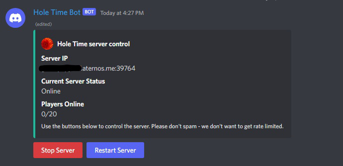

# Discord Aternos Dashboard
A discord bot providing a mini, easy to use control panel for your server hosted on [Aternos](https://aternos.org/). The control panel provides the ability to start, stop and restart your minecraft server, all from your discord server. Easy.

## TOS note
This bot will NOT circumvent Aternos' queue/waiting list system, and it will NOT fake player activity to keep your server on 24/7. It does not hog resources and won't make it unfair for other users. That said, Aternos' [terms of service](https://aternos.gmbh/en/aternos/terms) does mention `Automatically accessing our website or automating actions on our website`. If Aternos does somehow detect automation (unlikely), they do have the power to suspend your account, and _might_ decide to do so. Use this bot at your own risk.

# Setup
### Add the bot to your server
Create a bot, copy the client ID, paste it into the following URL then use the URL to add the bot to your discord server.

`https://discord.com/api/oauth2/authorize?client_id=YOUR_CLIENT_ID&permissions=2147552256&scope=bot%20applications.commands`

Once the bot is in your server, give it any necessary roles to allow it to send messages.

### Clone this repository
Then install dependencies. You will need to include the dev-dependencies initially to register the slash command.

### Update the config file
Create a new empty file called `config.json` and paste in the content from `config-TEMPLATE.json`. Fill in all of the blank fields:
- `TOKEN` - Your bot token, can be found on the discord developer portal.
- `CLIENT_ID` - Your bot client ID, can also be found on the discord developer portal.
- `GUILD_ID` - The ID of the discord server you will be using the bot in. Currently the bot only supports one server per instance. Can be found by turning on discord developer mode, then right click on the server icon and select 'Copy ID'.
- `DEV_ID` - Your discord user ID. Can be found by right clicking on your user, then selecting 'Copy ID' (after developer mode has been turned on).
- `ATERNOS_USERNAME` - The username for your aternos account.
- `ATERNOS_PASSWORD` - The password for your aternos account.
- `MINECRAFT_SERVER_NAME` - The name of your server. This can be whatever you want, its only purpose is to serve as the title for the control panel.

### Register the command
Run `registerSlashCommand.js`. This will add the `/sendmessage` command to your discord server. You only need to run it once after inviting the bot, but if you kick and then re-invite, you will need to run it again.
  
# Usage
### Run the bot
Run `index.js`, and wait until `Ready!` appears in the console.

### Create a control panel
Use the `/sendmessage` slash command in a channel to make the bot create a server control panel in that channel. You can use the command multiple times to create multiple messages (either in the same channel or different channels), but I don't recommend creating more than 2 or 3 because it starts taking too long to update all of them.

### Click the buttons to control the server
That's it! The server status will be displayed on the control panel, along with the IP + port and the number of online players.